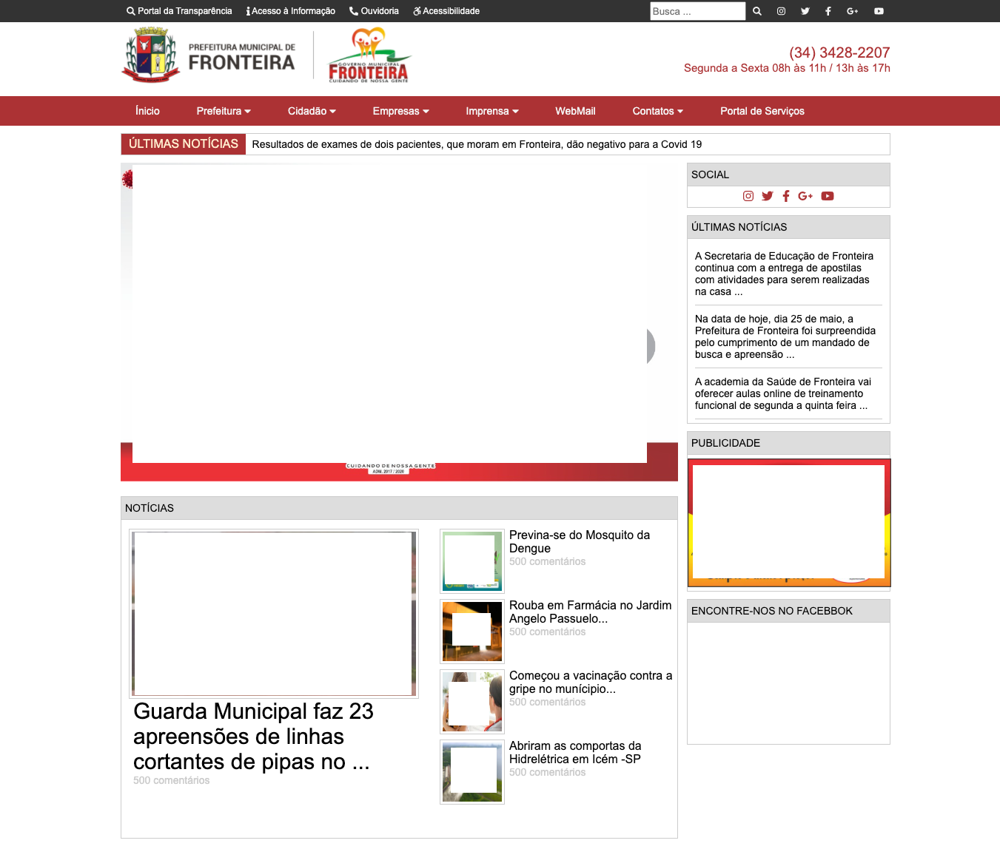

<h1 align="center"> Site Sugestivo para Fronteira
</h1>

 <a href="#-sobre-o-projeto">Sobre</a> •
 <a href="#-layout">Layout</a> • 
 <a href="#-tecnologias">Tecnologias</a> • 
 <a href="#-autor">Autor</a> • 

## 💻 Sobre o projeto

Este projeto diz para testar meus conhecimentos no posicionamento de elementos numa página.

---

## 🎨 Layout

### Tela de Adição e Listagem de Repositórios
As imagens estão com tarjas pretas pois não tenho direito sobre elas.

  

---

## 🛠 Tecnologias

As seguintes ferramentas foram usadas na construção do projeto:

-   **[HTML]
-   **[CSS]

## 💪 Como contribuir para o projeto

1. Faça um **fork** do projeto.
2. Crie uma nova branch com as suas alterações: `git checkout -b my-feature`
3. Salve as alterações e crie uma mensagem de commit contando o que você fez: `git commit -m "feature: My new feature"`
4. Envie as suas alterações: `git push origin my-feature`
> Caso tenha alguma dúvida confira este [guia de como contribuir no GitHub](./CONTRIBUTING.md)

---

## 🦸 Autor

Iranildo Fialho da Silva
